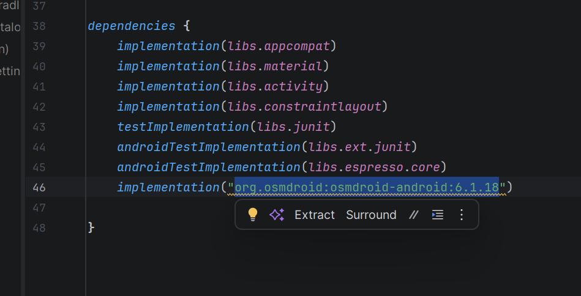
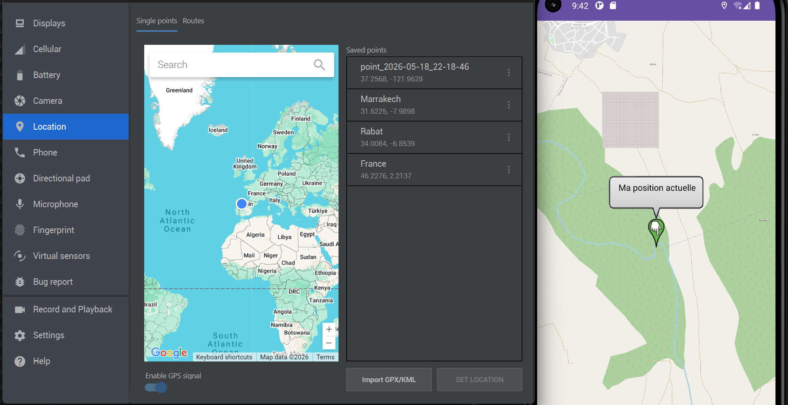

# LAB 11 -  GPS et Cartographie interactive 
**Cours :** Programmation Mobile : Android avec Java  
**Étudiant :** Hajar Chaira

---

## 1. Objectif 
L'objectif de ce laboratoire est de développer une application Android gérant la géolocalisation en temps réel et l'affichage cartographique interactif. Afin de garantir l'autonomie du système et de s'affranchir des contraintes de facturation de Google Cloud, l'implémentation a été réalisée en exploitant la bibliothèque open-source **osmdroid** (OpenStreetMap). L'exercice couvre la gestion du cycle de vie des capteurs GPS, les requêtes de permissions dynamiques au moment de l'exécution (runtime permissions) et la fluidité des transitions de caméra lors des changements de coordonnées.

---

## 2. Aperçu visuel du projet et Démonstration

### Captures d'écran de la configuration et de l'exécution

| Configuration du Manifest et Permissions  | Suivi GPS et Rendu Cartographique |
| :---: | :---: |
|   |  |
| Déclaration des permissions réseau et localisation requises pour le fonctionnement  | Affichage du marqueur dynamique centré sur les coordonnées simulées via Extended Controls |

---

## 3. Démonstration Vidéo
La vidéo ci-dessous illustre le fonctionnement complet de l'application en cours d'exécution. Elle met en évidence la demande d'autorisation initiale au lancement, la réaction instantanée du système lors du changement de position depuis le panneau de contrôle de l'émulateur (Extended Controls) et l'animation de centrage automatique de la carte.

[<video src="img-lab11-dev/video.mp4" controls="controls" style="max-width: 100%;">
</video>](https://github.com/user-attachments/assets/c7814504-f845-46ba-8216-4a0536b22ffa)

---

## 4. Étapes de réalisation et Choix techniques

### Étape 1 : Transition vers l'écosystème OpenStreetMap (osmdroid)
Au lieu de dépendre d'une activité modèle propriétaire Google Maps exigeant une clé d'API de facturation, le projet a été construit sur une structure standard `AppCompatActivity`. La bibliothèque officielle OpenStreetMap a été intégrée dans le fichier `build.gradle.kts (Module: app)` 

### Étape 2 : Déclaration des permissions système (`AndroidManifest.xml`)
Pour autoriser le téléchargement des tuiles cartographiques et la lecture des puces de localisation, le Manifest a été enrichi avec les autorisations de précision fine et approximative 

### Étape 3 : Initialisation et Configuration de la carte (`MapView`)
Dans le fichier de mise en page `res/layout/activity_main.xml`, un composant `org.osmdroid.views.MapView` a été déclaré en tant que vue racine.
Au sein de `MainActivity.java`, une étape indispensable de sécurité anti-spam a été ajoutée pour que les serveurs cartographiques (Mapnik) autorisent l'envoi des tuiles graphiques 

### Étape 4 : Suivi GPS robuste et Marqueur unique
Afin d'éviter d'instancier plusieurs marqueurs superflus à chaque micro-mouvement, un marqueur unique (`currentMarker`) a été mis en cache. Lors de la réception de nouvelles coordonnées via l'interface `LocationListener`, l'application déplace ce marqueur existant et effectue une animation fluide de la caméra vers la nouvelle position 

### Étape 5 : Gestion des puces de localisation de l'émulateur
Pour assurer un suivi réactif aux tests effectués sur l'émulateur, l'application écoute simultanément les fournisseurs matériels (`GPS_PROVIDER`) et réseau (`NETWORK_PROVIDER`). Le paramètre de distance minimale entre deux rafraîchissements a été fixé à `0` mètre, ce qui force la carte à se repositionner immédiatement lors de chaque clic sur le bouton *Set Location* de la fenêtre *Extended Controls*.

---

`map.onPause()`) en parfaite synchronisation avec le cycle de vie de l'activité Android.

---
**Rapport de TP - 2026**
